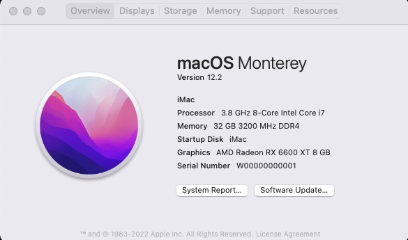
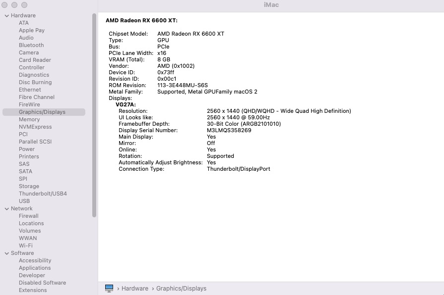
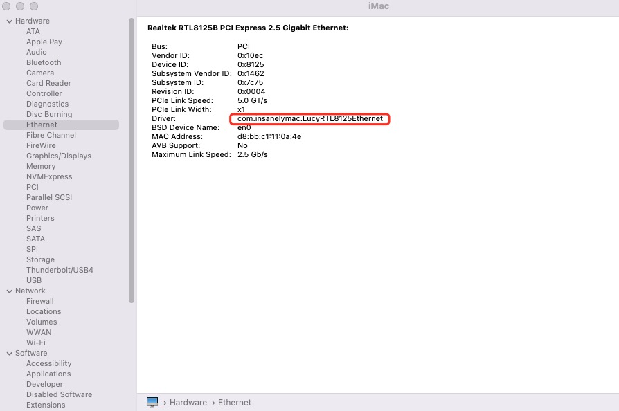

# OS version
macOS monterey 12.2

# OpenCore
version 0.7.7

# Hardware
* CPU: intel i7-10700k
* motherboard: MSI z490 gaming plus
* graphics: AMD Radeon RX 6600xt
* Memmory: 16GB x 2
 
## hardware quirks (IMPORTANT!!!)
* AMD 6600xt
	* add `agdpmod=pikera` in `NVRAM/7C436110-AB2A-4BBB-A880-FE41995C9F82/boot-args` (already in config.plist)
* CPU intel 10700k:
	* very important: `SystemProductName: iMac20,1` (already in config.plist)
* ethernet RTL8125B on MSI z490 gaming plus:
	* LucyRTL8125Ethernet.kext: use version `V1.1.0d12` (under `EFI/OC/Kexts/LucyRTL8125Ethernet.kext`) other than `V1.1.0`, or ethernet could not be found 

# Installation steps
* make partition as ESP partition, we shall use it under the following, or we can just use the default one
* download image from [link](https://mp.weixin.qq.com/s/9B1SMBEWbqgOrg7PGzLaCw), use [balenaEtcher](https://www.balena.io/etcher/) to flash the image into SD cards or USB drivers
* make sure to disable some features, such as `CFG lock`, `fast boot`, see [BIOS settings](https://dortania.github.io/OpenCore-Install-Guide/config.plist/comet-lake.html#intel-bios-settings)
* use [diskgenius](https://www.diskgenius.com/) to replace `OC` `BOOT` directories under `EFI` in `ESP` partition on USB driver
* install macOS from OpenCore
* copy directory `EFI` into ESP partition
* use [easyUEFI](https://www.easyuefi.com/) to add `/EFI/OC/OpenCore.efi` into boot list as the first item

# Note
* use USB2.0 port instead of USB3.0 if failed to install
* change serial number by yourself

# Screenshot

# Reference
* [OpenCore Install Guide](https://dortania.github.io/OpenCore-Install-Guide/)
* [HeiGuoXiaoBing's blog](https://mp.weixin.qq.com/s/9B1SMBEWbqgOrg7PGzLaCw)

